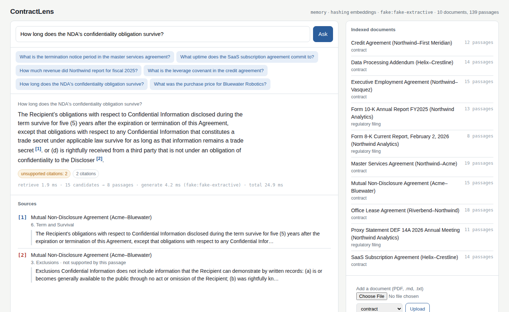

# ContractLens

Question answering over contracts and regulatory filings, where every sentence of the answer cites the passage it came from. Ask "what is the liability cap in the Helix agreement?" and get the clause, the section it lives in, and a grounding check that flags any citation the passage doesn't actually support. Before every release, an evaluation harness runs 150 gold questions through the system and blocks the deploy if faithfulness or relevance regress.

Built with Python, LangGraph, FastAPI, PostgreSQL + pgvector, Docker and AWS ECS.



## What's in it

- **LangGraph workflow**: `analyze_query → retrieve → process_context → generate → ground_check`, with a revision loop when a citation fails verification and an abstain path when nothing relevant is found.
- **Hybrid retrieval on pgvector**: vector search (HNSW) plus full-text search (GIN), fused with reciprocal rank fusion. Questions that name a document ("the NDA", "the 10-K") are scoped to it before searching.
- **Section-aware ingestion**: PDFs, Markdown and text are chunked at clause boundaries so each citation carries a document, section and page.
- **Eval harness with a release gate**: 150 questions across 10 documents, scored on faithfulness, relevance, fact correctness, retrieval hit rate and citation precision against thresholds in `evals/thresholds.yaml`. Exit code 1 fails the build.
- **Runs without keys**: deterministic embeddings and an extractive stand-in model let the whole stack, harness included, run in CI. Add an LLM API key for real answers and an LLM judge.
- **Deployable**: Dockerfile, Compose stack with pgvector, Terraform for ECS Fargate + RDS + ALB, and GitHub Actions for CI and gated deploys.

## How it works

```
POST /ask ──▶ analyze_query ──▶ retrieve ──▶ process_context ──▶ generate ──▶ ground_check ──▶ answer
               scope to the      vector +      rerank, dedupe,    numbered       verify every
               named document    full-text     fit to budget      passages       citation
                                    │
                                    └── nothing relevant ──▶ "not in the documents"
```

The UI, the CLI and the eval harness all call the same graph the API does.

## Evaluation

`contractlens eval` runs every gold question, writes `reports/latest.md`, and compares the aggregates to the active profile's thresholds. Latest offline run (stand-in model, real PostgreSQL + pgvector, all 150 questions):

| Metric | Value | Gate |
| --- | ---: | ---: |
| Faithfulness | 0.92 | ≥ 0.90 |
| Retrieval hit rate | 0.97 | ≥ 0.95 |
| Citation precision | 0.93 | ≥ 0.90 |
| Grounded rate | 1.00 | ≥ 0.90 |
| Fact correctness | 0.82 | ≥ 0.70 |
| Answer relevance | 0.59 | ≥ 0.55 |

Relevance is bounded by the extractive stand-in in the offline profile; the retrieval, grounding and citation numbers exercise the same code that runs in production. The report also breaks results down by question type and by document and lists every miss.

## Run it

You need Python 3.11+ and Docker. Everything works without API keys.

```bash
git clone https://github.com/pritichaudhariii/ContractLens.git
cd ContractLens
python -m venv .venv && source .venv/bin/activate
pip install -e ".[dev]"

docker compose up -d db            # PostgreSQL 16 + pgvector
contractlens ingest data/corpus    # index the 10 sample documents
contractlens serve                 # http://localhost:8000
```

Then try:

```bash
contractlens ask "How long does the NDA's confidentiality obligation survive?"
contractlens eval                  # the release gate
pytest                             # 19 tests, including a real pgvector suite
```

For real answers, copy `.env.example` to `.env` and set `ANTHROPIC_API_KEY`. Without Docker, the API falls back to an in-memory store, and `contractlens eval --embedded-postgres` starts a throwaway pgvector on its own.

## API

| | |
| --- | --- |
| `POST /ask` | question → answer, citations, grounding result, timing trace |
| `POST /documents` | upload a PDF, `.md` or `.txt` |
| `GET /documents` · `DELETE /documents/{id}` | list and remove indexed documents |
| `GET /health` · `GET /graph` | status, and the workflow as Mermaid |

Set `API_KEY` to require an `X-API-Key` header.

## Deploy

`infra/terraform` provisions a VPC, ECS Fargate service behind an ALB, RDS PostgreSQL 16, ECR, Secrets Manager and autoscaling. `terraform apply` with a DB password and API key, then push an image. The deploy workflow runs the eval harness in the production profile as the gate, pushes the image to ECR and rolls the service forward.

## Layout

```
src/contractlens/     graph, retrieval, scoping, grounding, ingest/, store/, evals/, api/, ui/
data/corpus/          10 sample documents          data/gold/   150-question gold set
evals/thresholds.yaml release gate                 infra/       AWS ECS Terraform
```

The sample documents are fictional and written for this project, so every gold fact can be verified against its source.

MIT licensed.
